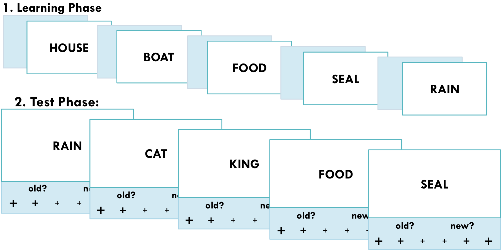
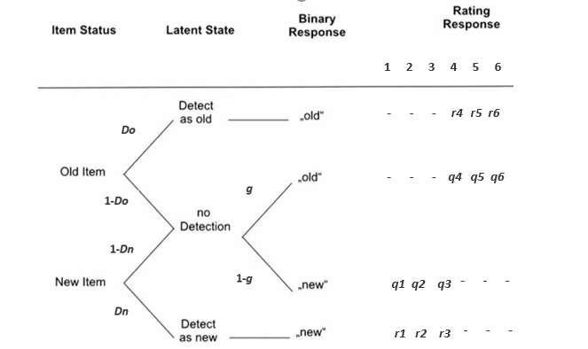

```{r setup, include=FALSE}
options(htmltools.dir.version = FALSE)
# see: https://github.com/yihui/xaringan
# install.packages("xaringan")
# see: 
# https://github.com/yihui/xaringan/wiki
# https://github.com/gnab/remark/wiki/Markdown
options(width=110)
options(digits = 4)
library("tidyverse")
library("reshape2")
library("broom") # for tidy
library("DescTools") # for CCC
library("ggpol") # for geom_boxjitter
data(roc6, package = "MPTinR")
source("../../scripts/auxiliary_functions.R")
source("../../scripts/summary_plots.R")

```


## Multiverse Approach

- Statistical analysis usually requires several (more or less) *arbitrary* decisions between reasonable alternatives:
  - Data processing and preparation (e.g., exclusion criteria, aggregation levels)
  - Analysis framework (e.g., statistical vs. cognitive model, frequentist vs. Bayes)
  - Statistical analysis (e.g., testing vs. estimation, fixed vs. random effects, pooling)

--


- Combination of decisions spans **multiverse** of data and results (Steegen, Tuerlinckx, Gelman, & Vanpaemel, 2016):
  - Usually one path through multiverse (*or* 'garden of forking paths', Gelman & Loken, 2013) is reported.
  - Valid conclusions cannot be contingent on arbitrary decisions.
  
--


- **Multiverse analysis** attempts exploration of possible results space:
  - Reduces problem of selective reporting by making fragility or robustness of results transparent.  
  - Conclusions arising from many paths are more credible than conclusions arising from few paths.
  - Helps identification of most consequential choices.


--

- **Limits of multiverse approach:**
  - Implementation not trivial.
  - Results must be commensurable across multiverse (e.g., estimation versus hypothesis testing).

---
class: small, inline-grey

### Current Project

- DFG 'Scientific Network' grant to Julia Groß and Beatrice Kuhlmann
  - 6 meetings over 3 years with 15 people plus external experts
  - "Hierarchical MPT Modeling – Methodological Comparisons and Application Guidelines"
  - Multinomial processing tree (MPT) models: class of discrete-state cognitive models for multinomial data (Riefer & Batchelder, 1988)
  - MPT models traditionally analyzed with frequentist methods (i.e., $\chi^2/G^2$) and aggregated data
  - Several hierarchical-Bayesian approaches exist. Do we need those?

--

### Our Multiverse

- Statistical framework:
  - Frequentist (i.e., maximum-likelihood)
  - Bayesian (i.e., MCMC)
- Pooling:
  - Complete pooling (aggregated data)
  - No pooling (individual-level data)
  - Partial pooling (hierarchical-modeling): Individual-level parameters with group-level distribution

  
- Results:
  1. Parameter point estimates: MLE and posterior mean
  2. Parameter uncertainty: ML-SE and MCMC-SE
  3. Model adequacy: $G^2$ $p$-value and posterior predictive $p$-value (Klauer, 2010)

---
class: inline-grey

## Our Multiverse Pipeline

- Developed (with Daniel Heck) `R` script which performs MPT multiverse analysis:
  - Requires participant-wise response frequencies and MPT model file (`eqn` syntax)
  1. Traditional approach: Frequentist asymptotic complete pooling
  2. Frequentist asymptotic no pooling
  3. Frequentist no-pooling with parametric bootstrap
  4. Bayesian complete pooling
  5. Bayesian no pooling
  6. Bayesian partial pooling I: Beta-MPT (Smith & Batchelder, 2010)
  6. Bayesian partial pooling II: Latent trait MPT (Klauer, 2010)
  6. Bayesian partial pooling III: Latent trait MPT w/o correlation parameters 
  

- Frequentist approaches use `MPTinR` (Singmann & Kellen, 2013)
- Bayesian approaches use `TreeBUGS` (Heck, Arnold, & Arnold, 2018), which uses `Jags`


--


- Currently developing (with Marius Barth) proper `R` package, `MPTmultiverse`:  
  https://github.com/mpt-network/MPTmultiverse
- Some new features and better usability

---
class: small

### Recognition Memory Task with Confidence Rating



---
class: small

### 2-high threshold model  (2HTM) for 6-point confidence-rating data (e.g., Bröder, et al., 2013)

.pull-left2[


]


- $r1 = r_1$
- $r2 = (1- r_1)r_2$
- $r3 = (1- r_1)(1 - r_2)$ 
- same for $q$ <br/><br/>
- $r6 = r_6$ 
- $r5 = (1- r_6)r_5$
- $r4 = (1- r_6)(1 - r_5)$
- same for $q$ <br/><br/>
- For $r$, $r_1$ and $r_6$ expected to have most data
- For $q$, $q_5$ and $q_2$ expected to have most data

<br><br>

- Data provides 10 independent data points:
  - 3 core parameters: $Dn$, $Do$, and $g$. 
  - 8 response mapping parameters $(r_1$, $q_1$, ...) 
- For identifiability: $r_2 = r_5$ (lowest two confidence response mapping of detection states equated)

---

## 6-point ROC Data Corpus from Klauer & Kellen (2015): 12 Data Sets

<br/>

.pull-left2[

| Data set        |Sample          | Mean No of Trials  |
|:-------------|:-------------:|:-----:|
|Dube & Rotello (2012, E1, Pictures (P))| 27  | 400 |
|Dube & Rotello (2012, E1, Words (W))|  22      |   400 |
|Heathcote et al. (2006, Exp. 1)  | 16     |    560 |
|Heathcote et al. (2006, Exp. 2) | 23 | 560|
|Jaeger et al. (2012, Exp. 1, no cue)|63|120|
|Jang et al. (2009)|33|140|
|Koen & Yonelinas (2010, pure study)|32|320|
|Koen & Yonelinas (2011)|20|600|
|Koen et al. (2013, Exp. 2, full attention)|48|200|
|Koen et al. (2013, Exp. 4, immediate test)|48|300|
|Pratte et al. (2010)|97|480|
|Smith & Duncan (2004, Exp. 2)|30|140|

]

.pull-right2[
- Total N = 459
- Mean trials = 350


3. Model adequacy: $G^2$ $p$-value and posterior predictive $p$-value (Klauer, 2010)
1. Parameter point estimates: MLE and posterior mean
2. Parameter uncertainty: ML-SE and MCMC-SE
  

]


---

class: small, center

```{r, include=FALSE, warning=FALSE}

load("../../koen2010/koen2010_rrest.eqn-Koen_2010_pure.csv.RData")
results3_2 <- results


load("../../koen2011/koen2011_rrest.eqn-Koen_2011.csv.RData")
results3_3 <- results


load("../../koen2013full/koen2013f_rrest.eqn-Koen-2013_full.csv.RData")
results3_4 <- results


load("../../pratte2010/pratte_rrest.eqn-Pratte_2010.csv.RData")
results3_5 <- results

load("../../smith2004/smith_rrest.eqn-Smith_2004.csv.RData")
results3_6 <- results

load("../../jang2009/jang_rrest.eqn-Jang_2009.csv.RData")
results3_7 <- results

load("../../dube2012p/dubep_rrest.eqn-Dube_2012-P.csv.RData")
results3_8 <- results

load("../../dube2012w/dubeW_rrest.eqn-Dube_2012-W.csv.RData")
results3_9 <- results

load("../../heathcote2006e1/heathcote_rrest.eqn-Heathcote_2006_e1.csv.RData")
results3_10 <- results

load("../../heathcote2006e2/heathcote2_rrest.eqn-Heathcote_2006_e2.csv.RData")
results3_11 <- results

load("../../jaeger2012/jaeger_rrest.eqn-Jaeger_2012.csv.RData")
results3_12 <- results

load("../../koen2013/koen_rrest.eqn-Koen_2013_immediate.csv.RData")
results3_13 <- results

results <- bind_rows(
  results3_2,
  results3_3,
  results3_4,
  results3_5,
  results3_6,
  results3_7,
  results3_8,
  results3_9,
  results3_10,
  results3_11,
  results3_12,
  results3_13
)

results$exp <- str_remove(results$dataset, "\\.csv")

tmp <- roc6 %>% 
  mutate(sum = rowSums(select(., starts_with("OLD"), starts_with("NEW")))) %>%
  group_by(exp) %>% 
  summarise(participants = n(), trials = round(mean(sum)))

results <- left_join(results, tmp)


results$pooling <- factor(results$pooling, 
                          levels = c("no", "complete",  "partial"), 
                          labels = c("No", "Comp", "PP"))

results$package <- factor(results$package, 
                          levels = c("MPTinR", "TreeBUGS"), 
                          labels = c("MR", "TB"))
results$method <- factor(results$method, 
                         levels = c("PB/MLE", "asymptotic", "simple", 
                                    "trait", "trait_uncorrelated","beta"), 
                       labels = c("PB", "asy", "ss", "trait", "trait_u","beta"))

results$inter <- with(results, interaction(method, pooling, package, 
                                       drop = TRUE, sep = " "))
results$inter <- fct_recode(results$inter,
                            "Comp asy" = "asy Comp MR", 
                            "Comp Bayes" = "ss Comp TB",
                            "No PB" = "PB No MR", 
                            "No asy" = "asy No MR", 
                            "No Bayes" = "ss No TB",
                            "Trait PP" = "trait PP TB", 
                            "Trait_u PP" = "trait_u PP TB",
                            "Beta PP" = "beta PP TB")
results$inter <- fct_relevel(results$inter, 
                             c("Comp asy", "Comp Bayes", 
                               "No asy", "No PB", "No Bayes",  
                               "Beta PP", "Trait PP", "Trait_u PP"))


results$dataset <- factor(results$dataset, levels = 
                            c("Jang_2009.csv", "Koen_2010_pure.csv",
                              "Koen_2011.csv", "Koen-2013_full.csv",
                              "Pratte_2010.csv", "Smith_2004.csv",
                              "Dube_2012-P.csv", "Dube_2012-W.csv",
                              "Heathcote_2006_e1.csv", "Heathcote_2006_e2.csv",
                              "Jaeger_2012.csv", "Koen_2013_immediate.csv"), 
                        labels = c("Jang9", "Koen10", "Koen11", "Koen13F",
                                   "Pratte10", "Smith4", "Dube12P",
                                   "Dube12W", "Heath6-1", "Heath6-2", "Jae12", 
                                   "Koen13I"))

```


```{r, echo = FALSE, warning=FALSE, fig.width=11, fig.height=6.5, dpi = 500, message=FALSE}

gof_a <- unnest(results, gof)

gof_a$focus <- factor(gof_a$focus, levels = c('cov', 'mean'),
                      labels = c('Covariance', 'Mean'))

gof_all <- filter(gof_a, focus %in% c("Mean"))
ggplot(gof_all, aes(y = p, 
                    x = inter, col=dataset)) + 
  geom_point(aes(size = participants)) +  
  geom_hline(yintercept = .05, lty = 2)+
  theme_bw() + coord_flip() +
  scale_y_continuous(breaks=seq(0,1,by=.5),limits=c(0,1), 
                     labels = c("0", "0.5", "1")) +
  labs(x='Analysis approach',y= expression(italic(p)), 
       color='Data set', title='Goodness of fit')+
  theme(text=element_text(size = 24))+
  theme(plot.title=element_text(face = 'bold',size=24, hjust = 0.5))
```

---

class: small

.left-pull2[

```{r, echo = FALSE, warning=FALSE, fig.width=11, fig.height=6.75, dpi = 500, message=FALSE}
all_pars <- unnest(results, est_group)

exclude_methods <- c("no.asymptotic.MPTinR", 
                     #"no.simple.TreeBUGS", 
                     "partial.beta.TreeBUGS")
all_pars <- droplevels( filter(all_pars, !(inter %in% exclude_methods)) )
core_parameters <- c("Do", "Dn", "g")
all_pars <- mutate(all_pars, 
                   core = ifelse(parameter %in% core_parameters, 
                                 "core", "aux"))

#pairs <- combn(sort(levels(all_pars$inter)), 2)
pairs <- combn(levels(all_pars$inter), 2)

all_pars_l <- vector("list", ncol(pairs))

for (i in seq_len(ncol(pairs))) {
  tmp_dat <- all_pars %>% 
    filter(inter %in% pairs[,i]) %>% 
    filter(core == "core") %>% 
    select(model, dataset, parameter, core, est, inter) %>% 
    spread(key = inter, value = est)
  colnames(tmp_dat)[(ncol(tmp_dat)-1):ncol(tmp_dat)] <- c("x", "y")
  tmp_dat$cond_x <- pairs[1,i]
  tmp_dat$cond_y <- pairs[2,i]
  all_pars_l[[i]] <- tmp_dat 
}

all_pars2 <- bind_rows(all_pars_l)
all_pars2$cond_x <- factor(all_pars2$cond_x, 
                            levels = levels(results$inter))
all_pars2$cond_y <- factor(all_pars2$cond_y, 
                          levels = levels(results$inter))


plot_text <- all_pars2 %>% 
  group_by(cond_x, cond_y) %>% 
  summarise(ccc = format(
    CCC(x, y, na.rm = TRUE)$rho.c$est, 
    digits = 2))

all_pars2 %>% 
  filter(core == "core") %>% 
  ggplot(aes(x = x, y = y)) +
  geom_abline(slope = 1, intercept = 0) +
  geom_point(aes(color = parameter)) +
  facet_grid(cond_x~ cond_y) +
    geom_text(data=plot_text,
            aes(x = 0.25, y = 0.9, label=ccc), 
            parse = TRUE, inherit.aes=FALSE, size = 4) +
  coord_fixed(xlim = c(0, 1), ylim = c(0, 1)) +
  scale_y_continuous(breaks = c(0, 0.5, 1), labels = c("0", ".5", "1")) +
  scale_x_continuous(breaks = c(0, 0.5, 1), labels = c("0", ".5", "1")) +
  ggtitle("Core parameters (Do, Dn, g)") +
  xlab("") + ylab("") +
  theme_bw()
```

]

Mean concordance correlation coefficient (CCC)

```{r, echo=FALSE}
tmp <- all_pars2 %>% 
  group_by(cond_x, cond_y, parameter) %>% 
  summarise(ccc = CCC(x, y, na.rm = TRUE)$rho.c$est) %>% 
  ungroup 
tmp %>% 
  select(cond_x, parameter, ccc) %>% 
  rename(cond_y = cond_x) %>% 
  bind_rows(select(tmp, cond_y, parameter, ccc)) %>% 
  group_by(parameter) %>% 
  summarise(mean = format(mean(ccc)), digits = 2)

tmp <- all_pars2 %>% 
  group_by(cond_x, cond_y) %>% 
  summarise(ccc = CCC(x, y, na.rm = TRUE)$rho.c$est) %>% 
  ungroup 

tmp %>% 
  select(cond_x, ccc) %>% 
  rename(cond_y = cond_x) %>% 
  bind_rows(select(tmp, cond_y, ccc)) %>% 
  group_by(cond_y) %>% 
  summarise(mean = format(mean(ccc)), digits = 2)

```


---

```{r, echo = FALSE, warning=FALSE, fig.width=11, fig.height=6.75, dpi = 500, message=FALSE}

all_pars_l <- vector("list", ncol(pairs))

for (i in seq_len(ncol(pairs))) {
  tmp_dat <- all_pars %>% 
    filter(inter %in% pairs[,i]) %>% 
    filter(core == "aux") %>% 
    select(model, dataset, parameter, core, est, inter) %>% 
    spread(key = inter, value = est)
  colnames(tmp_dat)[(ncol(tmp_dat)-1):ncol(tmp_dat)] <- c("x", "y")
  tmp_dat$cond_x <- pairs[1,i]
  tmp_dat$cond_y <- pairs[2,i]
  all_pars_l[[i]] <- tmp_dat 
}

all_pars2 <- bind_rows(all_pars_l)
all_pars2$cond_x <- factor(all_pars2$cond_x, 
                            levels = levels(results$inter))
all_pars2$cond_y <- factor(all_pars2$cond_y, 
                          levels = levels(results$inter))


plot_text <- all_pars2 %>% 
  group_by(cond_x, cond_y) %>% 
  summarise(ccc = format(
    CCC(x, y, na.rm = TRUE)$rho.c$est, 
    digits = 2))

all_pars2 %>% 
  filter(core == "aux") %>% 
  ggplot(aes(x = x, y = y)) +
  geom_abline(slope = 1, intercept = 0) +
  geom_point(aes(color = parameter)) +
  facet_grid(cond_x~ cond_y) +
    geom_text(data=plot_text,
            aes(x = 0.25, y = 0.9, label=ccc), 
            parse = TRUE, inherit.aes=FALSE, size = 4) +
  coord_fixed(xlim = c(0, 1), ylim = c(0, 1)) +
  scale_y_continuous(breaks = c(0, 0.5, 1), labels = c("0", ".5", "1")) +
  scale_x_continuous(breaks = c(0, 0.5, 1), labels = c("0", ".5", "1")) +
  ggtitle("Auxiliary (response mapping) parameters") +
  xlab("") + ylab("") +
  theme_bw()
```

```{r, echo=FALSE}
tmp <- all_pars2 %>% 
  group_by(cond_x, cond_y, parameter) %>% 
  summarise(ccc = CCC(x, y, na.rm = TRUE)$rho.c$est) %>% 
  ungroup 
tmp %>% 
  select(cond_x, parameter, ccc) %>% 
  rename(cond_y = cond_x) %>% 
  bind_rows(select(tmp, cond_y, parameter, ccc)) %>% 
  group_by(parameter) %>% 
  summarise(mean = format(mean(ccc)), digits = 2)

tmp <- all_pars2 %>% 
  group_by(cond_x, cond_y) %>% 
  summarise(ccc = CCC(x, y, na.rm = TRUE)$rho.c$est) %>% 
  ungroup 

tmp %>% 
  select(cond_x, ccc) %>% 
  rename(cond_y = cond_x) %>% 
  bind_rows(select(tmp, cond_y, ccc)) %>% 
  group_by(cond_y) %>% 
  summarise(mean = format(mean(ccc)), digits = 2)
```


---

```{r, echo = FALSE, warning=FALSE, fig.width=12, fig.height=6.75, dpi = 500, message=FALSE}

all_se <- all_pars %>% 
  select(-starts_with("ci_"), -condition) %>% 
  group_by(model, dataset, parameter) %>% 
  mutate(reference = se[ inter == "Comp asy" ]) %>% 
  mutate(expansion = se/reference,
         lexpansion = log(se/reference)) %>% 
  ungroup

pos_x <- c(0.5, 1, 2, 4, 8)
all_se %>% 
  #filter(inter != "Comp asy") %>% 
  filter(core == "core") %>% 
  ggplot(aes(x = inter, y = lexpansion)) +
  geom_boxjitter(outlier.color = NA, 
                 jitter.shape = NA, 
                 jitter.fill = c("transparent")) +
  geom_jitter(aes(x = as.numeric(inter)-0+0.3, color = dataset, 
                  size = participants), 
              width = 0) +
  scale_size(range = c(1, 4)) +
  facet_wrap(~parameter) +
  scale_y_continuous(breaks = log(pos_x), 
                     labels = pos_x, 
                     name = "SE-Expansion (log-scale)") +
  xlab("") + ggtitle("Core Parameters") +
  theme_bw(base_size = 24) +
  theme(axis.text.x = element_text(angle=90, hjust=1, vjust = 0.25))

```

---

```{r, echo = FALSE, warning=FALSE, fig.width=11, fig.height=6.75, dpi = 500, message=FALSE}


all_se %>% 
  filter(inter != "Comp asy") %>% 
  filter(core == "aux", parameter %in% c("r_1", "r_2", "r_5", "r_6")) %>% 
  ggplot(aes(x = inter, y = lexpansion)) +
  geom_boxjitter(outlier.color = NA, 
                 jitter.shape = NA, 
                 jitter.fill = c("transparent")) +
  geom_jitter(aes(x = as.numeric(inter)-1+0.3, color = dataset, 
                  size = participants), 
              width = 0) +
  scale_size(range = c(1, 4)) +
  facet_wrap(~parameter, nrow = 1) +
  scale_y_continuous(breaks = log(pos_x), 
                     labels = pos_x, 
                     name = "SE-Expansion (log-scale)") +
  xlab("") + ggtitle("Response Mapping: Detection States") +
  theme_bw(base_size = 24) +
  theme(axis.text.x = element_text(angle=90, hjust=1, vjust = 0.25))

```
---

```{r, echo = FALSE, warning=FALSE, fig.width=11, fig.height=6.75, dpi = 500, message=FALSE}


all_se %>% 
  filter(inter != "Comp asy") %>% 
  filter(core == "aux", parameter %in% c("q_1", "q_2", "q_5", "q_6")) %>% 
  ggplot(aes(x = inter, y = lexpansion)) +
  geom_boxjitter(outlier.color = NA, 
                 jitter.shape = NA, 
                 jitter.fill = c("transparent")) +
  geom_jitter(aes(x = as.numeric(inter)-1+0.3, color = dataset, 
                  size = participants), 
              width = 0) +
  scale_size(range = c(1, 4)) +
  facet_wrap(~parameter, nrow = 1) +
  scale_y_continuous(breaks = log(pos_x), 
                     labels = pos_x, 
                     name = "SE-Expansion (log-scale)") +
  xlab("") + ggtitle("Response Mapping: Uncertainty State") + 
  theme_bw(base_size = 24) +
  theme(axis.text.x = element_text(angle=90, hjust=1, vjust = 0.25)) +
  theme(legend.position="none")

```


---
class: inline-grey

# Summary and Conclusion

- Multiverse analysis of 6-point ROCs with 2HTM:
  1. General agreement in terms of model evaluation: 2HTM provides adequate account; exception are no pooling methods.
  2. Surprisingly strong agreement in terms of point estimates
  3. Complete pooling (i.e., aggregated data) appears to provide overconfident SEs (rarely too large SEs). Size of overconfidence depends strongly on parameter.
  

--


- **Note**: Results do not suggest that hierarchical models are not necessary.
- **Aggregation artifacts can occur**:
  - Learning & practice (e.g., Estes, 1956, Psych. Bull.; Evans, Brown, Mewhort, & Heathcote, in press, Psych. Review)
  - Confidence-rating ROCs in signal-detection theory (Trippas, Kellen, Singmann, et al., in press, PB&R)
- Whether or not aggregation artifacts occur, depends on task, model, and parameter. 
- Multiverse analysis (at least with a selection) appears generally advisable.
  
--


- Future: Variety of different models (e.g., source-memory, prospective memory, IAT, process dissociation, hindsight bias)
- `MPTmultiverse` provides `R` package for Bayesian and frequentist multiverse analysis of MPTs:
  https://github.com/mpt-network/MPTmultiverse


---
count: false

class: small

### References 
- Barchard, K. A. (2012). Examining the reliability of interval level data using root mean square differences and concordance correlation coefficients. *Psychological Methods*, 17(2), 294-308. https://doi.org/10.1037/a0023351
- Bröder, A., Kellen, D., Schütz, J., & Rohrmeier, C. (2013). Validating a two-high-threshold measurement model for confidence rating data in recognition. *Memory*, 21(8), 916-944. https://doi.org/10.1080/09658211.2013.767348
- Dube, C., Starns, J. J., Rotello, C. M., & Ratcliff, R. (2012). Beyond ROC curvature: Strength effects and response time data support continuous-evidence models of recognition memory. *Journal of Memory and Language*, 67(3), 389-406. https://doi.org/10.1016/j.jml.2012.06.002
- Jaeger, A., Cox, J. C., & Dobbins, I. G. (2012). Recognition confidence under violated and confirmed memory expectations. *Journal of Experimental Psychology: General*, 141(2), 282-301. https://doi.org/10.1037/a0025687
- Koen, J. D., Aly, M., Wang, W.-C., & Yonelinas, A. P. (2013). Examining the causes of memory strength variability: Recollection, attention failure, or encoding variability? *Journal of Experimental Psychology: Learning, Memory, and Cognition*, 39(6), 1726-1741. https://doi.org/10.1037/a0033671
- Steegen, S., Tuerlinckx, F., Gelman, A., & Vanpaemel, W. (2016). Increasing Transparency Through a Multiverse Analysis. *Perspectives on Psychological Science*, 11(5), 702-712. https://doi.org/10.1177/1745691616658637

---
count: false


```{r, echo = FALSE, warning=FALSE, fig.width=11, fig.height=6.75, dpi = 500, message=FALSE}

pos_x <- c(0.5, 1, 2, 4, 8)
all_se %>% 
  filter(inter != "Comp asy") %>% 
  filter(core == "core") %>% 
  ggplot(aes(x = inter, y = lexpansion)) +
  geom_boxjitter(outlier.color = NA, 
                 jitter.shape = NA, 
                 jitter.fill = c("transparent")) +
  geom_jitter(aes(x = as.numeric(inter)-1+0.3, color = dataset, 
                  size = trials), 
              width = 0) +
  scale_size(range = c(1, 4)) +
  facet_wrap(~parameter) +
  scale_y_continuous(breaks = log(pos_x), 
                     labels = pos_x, 
                     name = "Expansion (log-scale)") +
  xlab("") +
  theme_bw(base_size = 24) +
  theme(axis.text.x = element_text(angle=90, hjust=1, vjust = 0.25))

```

---
count: false


```{r, echo = FALSE, warning=FALSE, fig.width=11, fig.height=6.75, dpi = 500, message=FALSE}


all_se %>% 
  filter(inter != "Comp asy") %>% 
  filter(core == "aux", parameter %in% c("r_1", "r_2", "r_5", "r_6")) %>% 
  ggplot(aes(x = inter, y = lexpansion)) +
  geom_boxjitter(outlier.color = NA, 
                 jitter.shape = NA, 
                 jitter.fill = c("transparent")) +
  geom_jitter(aes(x = as.numeric(inter)-1+0.3, color = dataset, 
                  size = trials), 
              width = 0) +
  scale_size(range = c(1, 4)) +
  facet_wrap(~parameter, nrow = 1) +
  scale_y_continuous(breaks = log(pos_x), 
                     labels = pos_x, 
                     name = "Expansion (log-scale)") +
  xlab("") + ggtitle("Response Mapping: Detection States") +
  theme_bw(base_size = 24) +
  theme(axis.text.x = element_text(angle=90, hjust=1, vjust = 0.25)) 

```
---
count: false


```{r, echo = FALSE, warning=FALSE, fig.width=11, fig.height=6.75, dpi = 500, message=FALSE}


all_se %>% 
  filter(inter != "Comp asy") %>% 
  filter(core == "aux", parameter %in% c("q_1", "q_2", "q_5", "q_6")) %>% 
  ggplot(aes(x = inter, y = lexpansion)) +
  geom_boxjitter(outlier.color = NA, 
                 jitter.shape = NA, 
                 jitter.fill = c("transparent")) +
  geom_jitter(aes(x = as.numeric(inter)-1+0.3, color = dataset, 
                  size = trials), 
              width = 0) +
  scale_size(range = c(1, 4)) +
  facet_wrap(~parameter, nrow = 1) +
  scale_y_continuous(breaks = log(pos_x), 
                     labels = pos_x, 
                     name = "Expansion (log-scale)") +
  xlab("") + ggtitle("Response Mapping: Uncertainty State") + 
  theme_bw(base_size = 24) +
  theme(axis.text.x = element_text(angle=90, hjust=1, vjust = 0.25)) +
  theme(legend.position="none")

```

